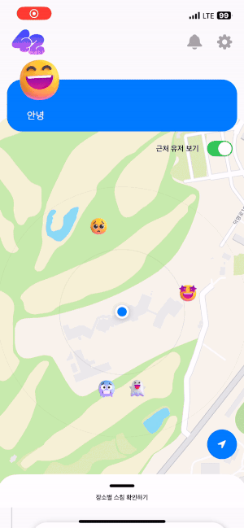
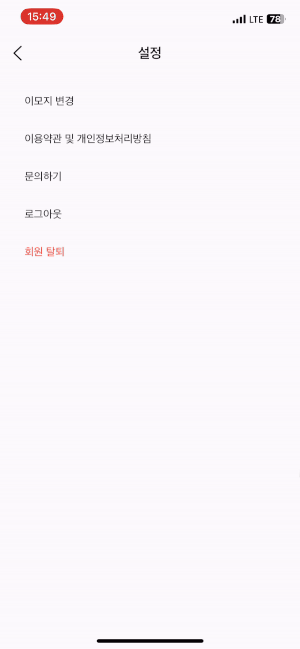
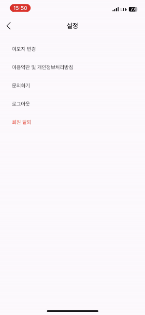
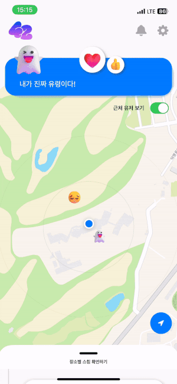

# 낭만을 찾아서 팀 - 사이


<br/>

### 서비스 이용하기

<div style="display: flex; justify-content: flex-start; align-items: center;">
  <a href="https://www.people42.com">
    
  </a>
  <a href="https://apps.apple.com/kr/app/%EC%82%AC%EC%9D%B4/id6448700604?itsct=apps_box_badge&amp;itscg=30200">
    
  </a>
  <a href='https://play.google.com/store/apps/details?id=com.cider.fourtytwo&pcampaignid=pcampaignidMKT-Other-global-all-co-prtnr-py-PartBadge-Mar2515-1'>
    
  </a>
</div>

</br>

### 소개 영상 보기 : [유튜브 바로가기](https://www.youtube.com/watch?v=j9oudzDFZMk)

<br/>

---

<br/>

## :clapper: 프로젝트 기간

<br/>

2023.04.10(월) ~ 2023.05.19(금) (6주간 진행)

2학기 자율프로젝트 - 사이

<br/>

<br/>

## :scroll: 개요

<br/>

### 가까운 사람들과 생각을 공유하고 인연을 확인하세요.

"사이"는 근거리 위치 기반 익명 SNS 서비스입니다.

내 생각을 등록하면 주변 사람들과 스침을 기록해줍니다.

내 생각도 기록하고 지나가는 인연들의 생각을 확인해보세요!

<br/>

## :musical_score: 주요기능

<br/>

- ### 위치 기반 서비스

  - 내 주변에서 스쳤던 사람들의 생각을 조회할 수 있습니다.

  - 어떤 사람과 어디서 몇 번 스쳤는지도 확인할 수 있습니다.

  - 맘에 드는 메시지는 감정을 표현할 수 있으며, 상대방에게 알림을 줍니다.

<br/>

- ### 실시간 서비스

  - 실시간으로 주변 유저의 활동을 확인할 수 있습니다.

  - 메시지를 변경하면 변경한 메시지를 주변 유저들에게 알려줍니다.

  - 내 글에 대한 반응을 알림으로 알 수 있습니다.

<br/>

## :hammer_and_wrench: 주요기술

<br/>

**Back-end : Spring Boot**

```Plain
- Springboot 2.7.10
- Spring Data JPA
- Spring Security
- QueryDSL
- Redis
- OAuth2
- MariaDB
- WebSocket
```

<br/>

**Front-end : 웹(React)**

```Plain Text
- Vite(React + Typescript)
- Recoil
- React-Router-Dom
- Axios
- Firebase Cloud Message(FCM)
- Web-Socket
- Styled-Components
- SEO(Open Graph, Helmet)
- Social Login(Google, Apple)
- Deep Link
```

<br/>

**Front-end : Android (Kotlin)**

```Plain
- 적어주세요
```

<br/>

**Front-end : IOS (Swift)**

```Plain
- SwiftUI
- UIKit
- CoreLocation
- Alamofire
- BackgroundTasks
- MapKit
- Firebase Cloud Message(FCM)
- URLSessionWebSocketTasks
- Deep Link
- Universal Link
- KeychaninSwidft
```

<br/>

**CI/CD**

```Plain
- Git Webhook
- Jenkins
- Docker
- Docker Compoose
- Docker Registry
- Nginx
- Letsencrypt
- AWS EC2
- AWS S3
- Kubernetes
- Nginx-Ingress
- Kubernetes Dashboard
```

<br/>

<br/>

## ✔ 프로젝트 구조

<br/>

### Back

<br/>

```Plain
fourtytwo
├─ .gitignore
├─ .gitkeep
├─ gradle
│  └─ wrapper
│     ├─ gradle-wrapper.jar
│     └─ gradle-wrapper.properties
├─ gradlew
├─ gradlew.bat
└─ src
   ├─ main
   │  ├─ java
   │  │  └─ com
   │  │     └─ fourtytwo
   │  │        ├─ auth
   │  │        │  ├─ JwtTokenProvider.java
   │  │        │  ├─ PrincipalDetails.java
   │  │        │  ├─ PrincipalDetailsService.java
   │  │        │  └─ RefreshTokenProvider.java
   │  │        ├─ config
   │  │        │  ├─ AppleConfig.java
   │  │        │  ├─ CorsConfig.java
   │  │        │  ├─ GoogleMapConfig.java
   │  │        │  ├─ JwtConfig.java
   │  │        │  ├─ KakaoConfig.java
   │  │        │  ├─ MariaDbConfig.java
   │  │        │  ├─ QueryDslConfig.java
   │  │        │  ├─ RedisConfig.java
   │  │        │  ├─ SecurityConfig.java
   │  │        │  ├─ WebMvcConfig.java
   │  │        │  └─ WebSocketConfig.java
   │  │        ├─ controller
   │  │        │  ├─ AccountController.java
   │  │        │  ├─ ApiResponse.java
   │  │        │  ├─ BrushController.java
   │  │        │  ├─ FeedbackController.java
   │  │        │  ├─ FeedController.java
   │  │        │  ├─ NotificationController.java
   │  │        │  ├─ SocketController.java
   │  │        │  └─ UserController.java
   │  │        ├─ dto
   │  │        │  ├─ block
   │  │        │  │  └─ BlockReqDto.java
   │  │        │  ├─ brush
   │  │        │  │  └─ BrushResDto.java
   │  │        │  ├─ fcm
   │  │        │  │  └─ FcmTokenReqDto.java
   │  │        │  ├─ feed
   │  │        │  │  ├─ ExpressReqDto.java
   │  │        │  │  ├─ NewFeedResDto.java
   │  │        │  │  ├─ PlaceFeedResDto.java
   │  │        │  │  ├─ RecentFeedResDto.java
   │  │        │  │  ├─ RecentUsersInfoResDto.java
   │  │        │  │  ├─ UserFeedResDto.java
   │  │        │  │  └─ UserPlaceFeedResDto.java
   │  │        │  ├─ feedback
   │  │        │  │  └─ FeedbackReqDto.java
   │  │        │  ├─ message
   │  │        │  │  ├─ MessageDeleteReqDto.java
   │  │        │  │  ├─ MessageResDto.java
   │  │        │  │  ├─ MyMessageHistoryResDto.java
   │  │        │  │  ├─ TotalMessagesCntResDto.java
   │  │        │  │  └─ UserMessageResDto.java
   │  │        │  ├─ notification
   │  │        │  │  ├─ NotificationCntResDto.java
   │  │        │  │  └─ NotificationHistoryResDto.java
   │  │        │  ├─ place
   │  │        │  │  ├─ GpsReqDto.java
   │  │        │  │  ├─ PlaceResDto.java
   │  │        │  │  ├─ PlaceWithTimeAndGpsResDto.java
   │  │        │  │  └─ PlaceWithTimeResDto.java
   │  │        │  ├─ report
   │  │        │  │  └─ ReportReqDto.java
   │  │        │  ├─ socket
   │  │        │  │  ├─ MessageDto.java
   │  │        │  │  ├─ MethodType.java
   │  │        │  │  └─ SessionInfoDto.java
   │  │        │  └─ user
   │  │        │     ├─ AccessTokenResDto.java
   │  │        │     ├─ AndroidGoogleRequestDto.java
   │  │        │     ├─ AndroidGoogleResponseDto.java
   │  │        │     ├─ AppleCodeReqDto.java
   │  │        │     ├─ AppleOAuthResponseDto.java
   │  │        │     ├─ ChangeEmojiReqDto.java
   │  │        │     ├─ GoogleOAuthResponseDto.java
   │  │        │     ├─ LoginRequestDto.java
   │  │        │     ├─ LoginResponseDto.java
   │  │        │     ├─ MessageReqDto.java
   │  │        │     ├─ MyInfoResDto.java
   │  │        │     ├─ NicknameReqDto.java
   │  │        │     ├─ NicknameResDto.java
   │  │        │     └─ SignupRequestDto.java
   │  │        ├─ entity
   │  │        │  ├─ BaseEntity.java
   │  │        │  ├─ Block.java
   │  │        │  ├─ Brush.java
   │  │        │  ├─ Emotion.java
   │  │        │  ├─ Expression.java
   │  │        │  ├─ Feedback.java
   │  │        │  ├─ Message.java
   │  │        │  ├─ Place.java
   │  │        │  ├─ Report.java
   │  │        │  └─ User.java
   │  │        ├─ exception
   │  │        │  ├─ CustomAccessDeniedHandler.java
   │  │        │  ├─ CustomAuthenticationEntryPoint.java
   │  │        │  └─ CustomExceptionHandler.java
   │  │        ├─ filter
   │  │        │  └─ JwtAuthenticationFilter.java
   │  │        ├─ FourtytwoApplication.java
   │  │        ├─ repository
   │  │        │  ├─ alert
   │  │        │  │  ├─ ReportRepository.java
   │  │        │  │  ├─ ReportRepositoryCustom.java
   │  │        │  │  └─ ReportRepositoryImpl.java
   │  │        │  ├─ block
   │  │        │  │  └─ BlockRepository.java
   │  │        │  ├─ brush
   │  │        │  │  ├─ BrushRepository.java
   │  │        │  │  ├─ BrushRepositoryCustom.java
   │  │        │  │  └─ BrushRepositoryImpl.java
   │  │        │  ├─ emotion
   │  │        │  │  └─ EmotionRepository.java
   │  │        │  ├─ expression
   │  │        │  │  └─ ExpressionRepository.java
   │  │        │  ├─ feedback
   │  │        │  │  └─ FeedbackRepository.java
   │  │        │  ├─ message
   │  │        │  │  ├─ MessageRepository.java
   │  │        │  │  ├─ MessageRepositoryCustom.java
   │  │        │  │  └─ MessageRepositoryImpl.java
   │  │        │  ├─ place
   │  │        │  │  ├─ PlaceRepository.java
   │  │        │  │  ├─ PlaceRepositoryCustom.java
   │  │        │  │  └─ PlaceRepositoryImpl.java
   │  │        │  └─ user
   │  │        │     ├─ UserRepository.java
   │  │        │     ├─ UserRepositoryCustom.java
   │  │        │     └─ UserRepositoryImpl.java
   │  │        └─ service
   │  │           ├─ BlockService.java
   │  │           ├─ ExpressService.java
   │  │           ├─ FcmService.java
   │  │           ├─ FeedbackService.java
   │  │           ├─ FeedService.java
   │  │           ├─ GpsService.java
   │  │           ├─ MessageService.java
   │  │           ├─ NotificationService.java
   │  │           ├─ ReportService.java
   │  │           ├─ UserService.java
   │  │           └─ WebSocketService.java
   │  └─ resources
   │     ├─ application.properties
   │     └─ word_set.json
   └─ test
      └─ java
         └─ com
            └─ fourtytwo
               ├─ AccountControllerTest.java
               ├─ FeedControllerTest.java
               └─ FourtytwoApplicationTests.java
```

<br/>

### WEB

<br/>

```Plain

```

<br/>

### iOS

<br/>

```Plain
fourtytwo
├── fourtytwoApp.swift
├── ContentView.swift
├── Info.plist
├── Supports
│   ├── AppDelegate.swift
│   ├── SceneDelegate.swift
│   ├── KeychainSwiftDistrib.swift
│   └── GoogleService-Info.plist
├── AppState
│   ├── AuthState.swift
│   └── ViewState.swift
├── Design
│   ├── Assets.xcassets
│   ├── Color.swift
│   ├── Font.swift
│   └── Fonts
│       └── Roboto-Medium.ttf
├── Services
│   ├── APIManager.swift
│   ├── AccountService.swift
│   ├── CommonService.swift
│   ├── FeedService.swift
│   ├── LocationManager.swift
│   ├── LocationSender.swift
│   ├── LocationService.swift
│   ├── NotificationService.swift
│   ├── UserService.swift
│   └── WebSocketManager.swift
├── Components
│   ├── ActivityIndicator.swift
│   ├── BlockView.swift
│   ├── CustomButton.swift
│   ├── GifImage.swift
│   ├── LocationCard.swift
│   ├── MessageCard.swift
│   ├── MyMassageCard.swift
│   ├── ReactionButton.swift
│   ├── RefreshableModifier.swift
│   ├── ReportView.swift
│   ├── TopAlignedTextEditor.swift
│   └── Useless
│       ├── GifUIkit.swift
│       ├── TimelineView.swift
│       └── WrappedMap.swift
├── Pages
│   ├── AlertPage
│   │   ├── AlertView.swift
│   │   └── Elements
│   │       └── AlertCard.swift
│   ├── HomePage
│   │   ├── Elements
│   │   │   ├── CustomBottomSheet.swift
│   │   │   ├── MapView.swift
│   │   │   ├── NavBar.swift
│   │   │   ├── OverView.swift
│   │   │   └── PlaceTimelineView.swift
│   │   └── HomeView.swift
│   ├── LoginPage
│   │   ├── Elements
│   │   │   ├── AppleSigninButton.swift
│   │   │   └── GoogleSigninButton.swift
│   │   └── LoginView.swift
│   ├── MyMindPage
│   │   ├── Elements
│   │   │   ├── DragToDeleteView.swift
│   │   │   └── MyMassageHistory.swift
│   │   └── MyMindView.swift
│   ├── PersonPage
│   │   ├── Elements
│   │   │   ├── PersonMessageCard.swift
│   │   │   └── PlacePersonView.swift
│   │   └── PersonView.swift
│   ├── PlacePage
│   │   ├── Elements
│   │   │   └── PlaceMapView.swift
│   │   └── PlaceView.swift
│   ├── SignupPage
│   │   ├── Elements
│   │   │   ├── FirstSectionView.swift
│   │   │   ├── SecondSectionView.swift
│   │   │   ├── SegmentedProgressBar.swift
│   │   │   └── ThirdSectionView.swift
│   │   └── SignupView.swift
│   ├── SplashPage
│   │   └── SplashView.swift
│   └── SystemPage
│       ├── Elements
│       │   ├── EmojiSwapView.swift
│       │   ├── NavLink.swift
│       │   ├── NicknameChangeView.swift
│       │   └── PolicyWebView.swift
│       └── SystemView.swift
├── Preview Content
│   └── Preview Assets.xcassets
│       └── Contents.json
└── fourtytwo.entitlements
```

<br/>

### Android

<br/>

```Plain

```

<br/>

## ✔ 협업 툴

<br/>

- Git
- Notion
- JIRA
- Figma
- MatterMost
- Webex

<br/>

## ✔ 협업 환경

<br/>

- Gitlab
  - 코드의 버전을 관리
  - platform별 브랜치를 구분하고 개발 workflow에 따라 관리
  - platform별 develop과 built 브랜치를 구분해서 CI/CD
  - 정해진 commit style에 맞춰 커밋 기록 관리
- JIRA
  - 매주 목표량을 설정하여 Sprint 진행
  - 업무의 할당량을 정하여 Story Point를 설정하고, In-Progress -> Done 순으로 작업
- 회의
  - 아침회의 진행, 전날 목표 달성량과 당일 할 업무 브리핑
  - 오류나 협업이 필요한 일이라면 빠른 mattermost를 통해 관련 내용을 전달하고 상의
- Notion
  - 회의가 있을 때마다 회의록을 기록하여 보관
  - 개인 일정 공유
  - 컨벤션 정리
  - 와이어프레임, 기능명세서, ERD, API 리스트 등 산출물 실시간 공유
- Figma
  - 피그마 디자인을 이용한 와이어 프레임 설계
  - 피그마 디자인을 이용한 와이어 목업 설계
  - 발표 자료 제작과 중간 결과물 실시간 공유
- Matter Most
  - 작업시 소통을 위한 도구, 공유할 내용이 있다면 올리는 공간
  - 짧은 코드나 참조 url 등을 다이렉트로 전달

<br/>

## ✔ 팀원 역할

<br/>

| 성명                                    | 깃허브아이디 | 담당    | 기술스택                           |
| --------------------------------------- | ------------ | ------- | ---------------------------------- |
| [장운창](https://github.com/potato3641) | potato3641   | CI/CD   | Doker / Jenkins / Kubernetes / SQL |
| [윤성운](https://github.com/ysu6691)    | ysu6691      | BE      | JAVA / SpringBoot                  |
| [임희상](https://github.com/hslim9400)  | hslim9400    | BE      | JAVA / SpringBoot                  |
| [정민우](https://github.com/minu-j)     | minu-j       | FE      | React / TypeScript                 |
| [전동인](https://github.com/qorzi)      | qorzi        | iOS     | SwiftUI / Swift                    |
| [김진희](https://github.com/robotdiary) | robotdiary   | Android | AndroidStudio / Kotlin             |

<br/>

## :triangular_flag_on_post: Project Info

<br/>

### **깃 구조**

```
GIT LAB
  ├── fe
  │   └── forty-two
  ├── be
  │   └── fourtytwo
  ├── ios
  │   └── fourtytwo
  ├── android
  │   └── fourtytwo
  ├── docker-compose.yml
  ├── README.md
  ├── assets
  ├── excute
  ├── .gitconfig
  └── .githooks
```

```
GIT HUB
  ├── fe-deploy.yaml
  ├── fe-svc.yaml
  ├── be-deploy.yaml
  ├── be-svc.yaml
  └── ingress-42.yaml
```

<br/>

### **브랜치전략**


<br>

### **파이프라인**


<br>

### Figma - 와이어프레임, 화면설계, 화면정의서

[Figma Link](https://www.figma.com/file/L3CelmgNIWFyPxj8kOer0Z/Untitled?type=design&node-id=234%3A4145&t=Xta8lvodXhF1Ulea-1)


<br>

### 기능명세서

[기능명세서](https://stupendous-thyme-e20.notion.site/947ce8102b0943c68886b3a4568d360e?v=2a266aa334904b91a528e862060d797d)


<br/>

### 아키텍쳐 설계

- 라이브 아키텍쳐
  
  <br><br>

- 개발 아키텍쳐
  
  <br><br>

### E-R Diagram


<br><br>

### API 명세서

[API 명세서 LINK](https://stupendous-thyme-e20.notion.site/API-811a407d9fea4e1ab3b86bc83ee70c62)


<br><br>

## 서비스 화면

<br/>

### Web

<br/>

회원가입

- 랜덤으로 고유한 닉네임을 선택할 수 있습니다.
- 움직이는 프로필 이미지를 선택할 수 있습니다.
- 약관 동의 후, 회원가입을 진행할 수 있습니다.


<br/>

홈 피드

- 글을 작성/삭제할 수 있습니다.
- 실시간으로 근처 유저의 입장과 활동을 확인할 수 있습니다.
- 마주친 장소와 유저를 간략하게 확인할 수 있습니다.


알림

- 내 게시글에 달린 리액션을 알림으로 확인할 수 있습니다.


<br/>

장소별 피드

- 해당 장소에 대한 스침을 확인할 수 있습니다.


<br/>

사용자별 피드

- 해당 사용자와 스쳤던 장소와 내용을 확인할 수 있습니다.
- 사람별 피드에서 메세지를 신고하거나 해당 유저를 차단할 수 있습니다.


<br/>

테마

- 라이트/다크 모드를 변경할 수 있습니다.


<br/>

<br/>

### iOS

<br/>

회원가입

- 랜덤으로 고유한 닉네임을 선택할 수 있습니다.
- 움직이는 프로필 이미지를 선택할 수 있습니다.
- 약관 동의 후, 회원가입을 진행할 수 있습니다.

<p align="left">


</p>

<br/>

글 작성&삭제

- 글을 작성할 수 있습니다.
- 드래그로 글을 삭제할 수 있습니다.

<p align="left">

</p>

<br/>

홈

- 실시간으로 근처 유저의 입장과 활동을 확인할 수 있습니다.
- 지도를 조작할 수 있습니다.
- 마주친 장소와 유저를 간략하게 확인할 수 있습니다.

<p align="left">


</p>

<br/>

알림

- 내 게시글에 달린 리액션을 알림으로 확인할 수 있습니다.

<p align="left">

</p>

<br/>

장소별 피드

- 해당 장소에 대한 스침을 확인할 수 있습니다.

<p align="left">

</p>

<br/>

사용자별 피드

- 해당 사용자와 스쳤던 장소와 내용을 확인할 수 있습니다.

<p align="left">

</p>

<br/>

신고&차단

- 장소별 피드에서 메세지를 신고하거나 해당 유저를 차단할 수 있습니다.
- 사용자별 피드에서 해당 유저를 차단할 수 있습니다.
- 차단된 유저와 서로 확인할 수 없게 됩니다.

<p align="left">


</p>

<br/>

설정

- 프로필 이미지를 변경할 수 있습니다.
- 이용약관 및 개인정보처리방침을 확인할 수 있습니다.
- 문의할 수 있습니다.

<p align="left">



</p>

<br/>

테마

- 라이트/다크 모드를 변경할 수 있습니다.

<p align="left">

</p>

<br/>

딥링크&유니버셜링크

- 웹사이트에서 바로 다운받거나 어플로 진입할 수 있습니다.
- 링크를 통해 바로 어플로 진입할 수 있습니다.

<p align="left">


</p>

<br/>

### Android

<br/>
