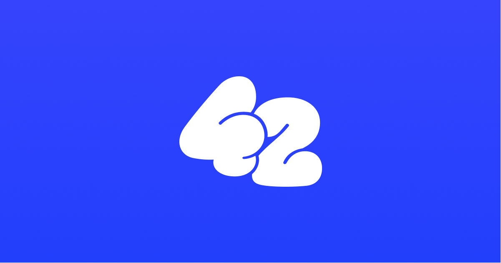
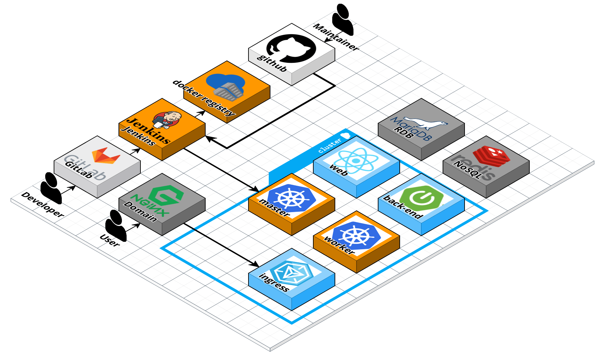

# 낭만을 찾아서 팀 - 사이



## 42

- 근거리 위치 기반 익명 SNS 서비스입니다.

- 실시간으로도 주변 유저를 만나볼 수 있습니다.

### 42 링크 : https://www.people42.com

## :clapper: 프로젝트 기간

1. 2023 04 10 (월) ~ 2023 05 19 (금)

2. 자율프로젝트 - 사이

## :scroll: 개요

### 가까운 사람들과 생각을 공유하고 인연을 확인하세요.

"사이"는 근거리 위치 기반 익명 SNS 서비스입니다.

내 생각을 등록하면 주변 사람들과 스침을 기록해줍니다.

내 생각도 기록하고 지나가는 인연들의 생각을 확인해보세요!

## :musical_score: 주요기능

### 1. 위치 기반 서비스

- 내 주변에서 스쳤던 사람들의 생각을 조회할 수 있습니다.

- 어떤 사람과 어디서 몇 번 스쳤는지도 확인할 수 있습니다.

- 맘에 드는 메시지는 감정을 표현할 수 있으며, 상대방에게 알림을 줍니다.

### 2. 실시간 서비스

- 실시간으로 주변 유저의 이모지를 확인해 볼 수 있습니다.

- 메시지를 변경하면 변경한 메시지를 주변 유저들에게 알려줍니다.

## :hammer_and_wrench: 프로젝트에 사용된 기술

---

**Back-end : Spring Boot**

```Plain
- Springboot 2.7.10
- Spring Data JPA
- Spring Security
- QueryDSL
- Redis
- OAuth2
- MariaDB
- WebSocket
```

**Front-end : 웹(React)**

```Plain Text
- Vite(React + Typescript)
- Recoil
- React-Router-Dom
- Axios
- Firebase Cloud Message(FCM)
- Web-Socket
- Styled-Components
- SEO(Open Graph, Helmet)
- Social Login(Google, Apple)
- Deep Link
```

**Front-end : Android (Kotlin)**

```Plain
- 적어주세요
```

**Front-end : IOS (Swift)**

```Plain
- 적어주세요
```

**CI/CD**

```Plain
- Git Webhook
- Jenkins
- Docker
- Docker Compoose
- Docker Registry
- Nginx
- Letsencrypt
- AWS EC2
- AWS S3
- Kubernetes
- Nginx-Ingress
- Kubernetes Dashboard
```

## :rocket: 협업방식

---

### **Matter Most**

- 작업시 소통을 위한 도구

- 짧은 코드나 참조 url 공유

### **Notion**

- Config 정리

- 회의록 저장

- 피드백 공유

- 일정 공유

### **Figma**

- 와이어 프레임 구성

- 프론트의 작업 지침서

### **Jira**

- 일정 관리

### **Git-lab**

- 개발 코드 형상 관리

- 메인, 작업 브랜치와 개인 브랜치 구분

<br><br>

## :triangular_flag_on_post: Project Info

---

### **깃 구조**

```
GIT LAB
  ├── fe
  │   └── forty-two
  ├── be
  │   └── fourtytwo
  ├── ios
  │   └── fourtytwo
  ├── android
  │   └── fourtytwo
  ├── docker-compose.yml
  ├── README.md
  ├── assets
  ├── excute
  ├── .gitconfig
  └── .githooks
```

```
GIT HUB
  ├── fe-deploy.yaml
  ├── fe-svc.yaml
  ├── be-deploy.yaml
  ├── be-svc.yaml
  └── ingress-42.yaml
```

### **브랜치전략**


<br><br>

### **파이프라인**


<br><br>

### Figma - 와이어프레임, 화면설계, 화면정의서

[Figma Link](https://www.figma.com/file/L3CelmgNIWFyPxj8kOer0Z/Untitled?type=design&node-id=234%3A4145&t=Xta8lvodXhF1Ulea-1)
<br><br>

### 기능명세서

[기능명세서](https://stupendous-thyme-e20.notion.site/947ce8102b0943c68886b3a4568d360e?v=2a266aa334904b91a528e862060d797d)

 <br><br>

### 아키텍쳐 설계

- 라이브 아키텍쳐
  
  <br><br>

- 개발 아키텍쳐
  
  <br><br>

### E-R Diagram


<br><br>

### API 명세서

[API 명세서 LINK](https://stupendous-thyme-e20.notion.site/API-811a407d9fea4e1ab3b86bc83ee70c62)
<br><br>

## 서비스 화면

(대충 웹, Android, IOS가 gif찍어달라는 내용)

### Web

회원가입 


홈 피드 


- FCM Notification 


- Web Socket 


장소별 피드 


사용자별 피드 


테마 


